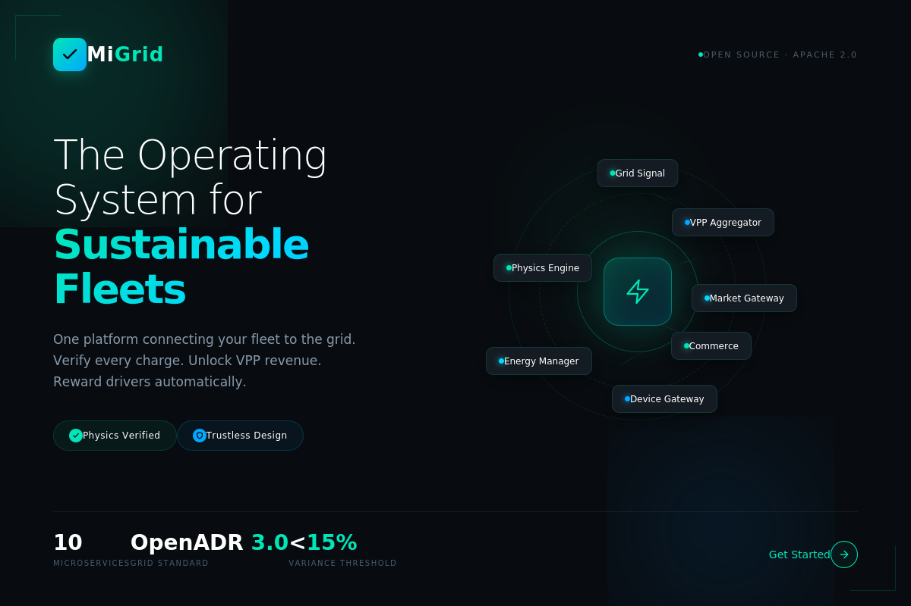
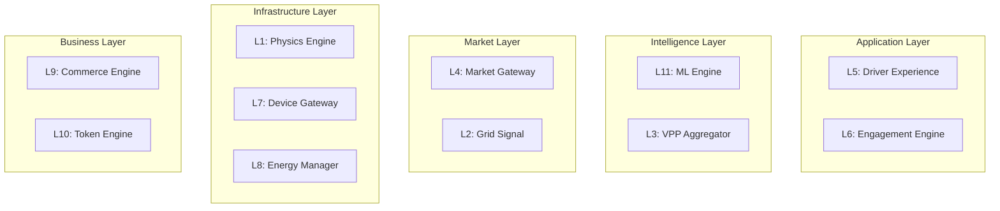

<div align="center">



# MiGrid

### *The Operating System for Sustainable Fleet Electrification*

[](https://github.com/dcplatforms/Migrid/releases)
[](LICENSE)
[](docs/roadmap.md)
[](https://nodejs.org)
[](https://www.docker.com)

[Features](#key-features) • [Architecture](#technical-architecture) • [Quick Start](#quick-start) • [Documentation](#documentation) • [Roadmap](docs/roadmap.md)

</div>

---

## Overview

MiGrid is an **open-source, enterprise-grade operating system** designed to transform electric vehicle fleets from simple transportation assets into **active, revenue-generating participants** in the energy grid.

Our unified 11-layer platform spans from the **physics of energy transfer** to the **tokenization of grid-supportive actions**, enabling fleets to participate in wholesale energy markets, demand response programs, and Vehicle-to-Grid (V2G) operations.

# MiGrid: The Operating System for Sustainable Fleets

  

**MiGrid** is an open-source, vertically integrated operating system designed to bridge the gap between physical EV assets and digital energy markets. We enable fleets to turn parked vehicles into revenue-generating Virtual Power Plants (VPPs) through physics-verified, standards-compliant orchestration.

---

## Core Philosophy

We do not trust the driver; we verify the physics.

1.  **Verify the Physics:** Every charging session is audited against a **Physics Engine** (L1) that compares energy dispensed vs. battery capacity with a strict `<15%` variance threshold.
2.  **Unlock the Grid:** We don't just consume energy; we manage it. Our stack is built for **OpenADR 3.0** compliance, turning load shedding and price signals into automated fleet actions.
3.  **Tokenize Value:** Grid-supportive behaviors are measured, verified, and rewarded directly to the driver's wallet via our **Token Bridge** (L10).

---

## Platform Engineering

MiGrid is built on a streamlined, high-precision architecture designed for the realities of critical infrastructure. Our engineering principles prioritize physics verification, low-latency data processing, and uncompromising security.

### Core Architectural Pillars

* **Physics-First Verification (L1):** We do not trust digital signals blindly. All energy transactions are validated against a proprietary **Physics Engine** that audits charging sessions using "Digital Twin" models to detect anomalies and enforce capacity limits.
* **Real-Time, Low-Latency Data:** The platform utilizes **Redis** for sub-millisecond state caching and **Apache Kafka** for event streaming, enabling real-time responsiveness for frequency regulation (<500ms) and high-frequency market bidding.
* **Edge-to-Cloud Resilience:** Our **Edge Runtime** ensures site-level orchestration and mesh networking continue seamlessly even without cloud connectivity ("The Fuse Rule"), supported by a **Multi-Region Active-Active** cloud deployment for global resilience.

### Technology Stack & Standards

We leverage a modern, cloud-native stack to ensure scalability and adherence to global energy standards:

* **Infrastructure as Code:** Fully containerized deployments via **Docker** and **Kubernetes**, managed with **Terraform**.
* **Data Layer:** **TimescaleDB** for high-fidelity time-series energy metrics and **PostgreSQL** for relational core data.
* **Security & Compliance:** Built on a **Zero-Trust Architecture** with mTLS everywhere. We strictly adhere to **NERC CIP** and **IEC 62351** cybersecurity standards.
* **Interoperability:** Native support for **OpenADR 3.0** (VEN), **OCPP 2.0.1** (Smart Charging), and **ISO 15118** (Plug & Charge).

---

## 10-Layer Microservices Architecture

The system is decoupled into ten distinct functional planes to separate concerns between physics, markets, and user experience.

| Layer | Service | Description | Standards |
| :--- | :--- | :--- | :--- |
| **L1** | `physics-engine` | The "Green Audit" — verifies kWh dispensed vs received. | PL/pgSQL |
| **L2** | `grid-signal` | Virtual End Node (VEN) for utility communication. | OpenADR 3.0 |
| **L3** | `vpp-aggregator` | Aggregates EVs & BESS for wholesale markets. | IEEE 2030.5 |
| **L4** | `market-gateway` | Arbitrage engine for CAISO, PJM, and Nord Pool. | FIX / OASIS |
| **L5** | `driver-dx` | Smart routing, voice commands, and availability. | GraphQL |
| **L6** | `engagement` | CRM, contextual support, and notifications. | WebSocket |
| **L7** | `device-gateway` | Hardware abstraction for chargers. | OCPP 2.0.1 / ISO 15118 |
| **L8** | `energy-manager` | Edge-ready dynamic load management (DLM). | Modbus TCP |
| **L9** | `commerce-engine`| Flexible billing, tariffs, and split-billing. | Stripe / OCPI |
| **L10**| `token-bridge` | Rewards and staking via Open-Wallet. | ERC-20 / Polygon |

---

### Core Philosophy

<table>
<tr>
<td width="33%" valign="top">

**[I] Verify the Physics**

*"Verify the physics. Unlock the grid."*

Every charging session is audited to ensure energy dispensed matches energy received (<15% variance threshold).

</td>
<td width="33%" valign="top">

**[II] Unlock the Grid**

*"The Grid is a partner, not just a plug."*

Active site load management, utility signal response, and grid stability prioritization.

</td>
<td width="33%" valign="top">

**[III] Tokenize Everything**

*"Every electron must be a tokenized asset."*

Grid-supportive actions are measured, valued, and rewarded through Web3 incentives.

</td>
</tr>
</table>

---

## Key Features

<details open>
<summary><b>[▸] Full-Stack V2G/VPP Control</b></summary>

Built from the ground up to support **FERC Order 2222**, enabling fleets to:
- Aggregate EVs into 100kW+ Virtual Power Plants (VPPs)
- Bid into wholesale energy markets (CAISO, PJM, ERCOT)
- Participate in demand response programs
- Generate revenue from grid services

</details>

<details open>
<summary><b>[▸] Fintech-Grade Ledger</b></summary>

Treats every kilowatt-hour and dollar as a high-precision asset:
- PostgreSQL with TimescaleDB for time-series data
- Decimal.js for zero rounding errors
- Complete financial audit trail
- Real-time settlement reconciliation

</details>

<details open>
<summary><b>[▸] Tokenized Driver Incentives</b></summary>

Built-in Web3 rewards system via [Open-Wallet Framework](https://github.com/ThomasC3/open-wallet):
- ERC-20 tokens on Polygon
- Reward drivers for grid-friendly behavior
- Smart charging bonuses
- V2G participation rewards
- Gamification and leaderboards

</details>

<details open>
<summary><b>[▸] Hardware Agnostic</b></summary>

Universal hardware abstraction layer:
- OCPP 2.0.1 & OCPP 1.6 support
- ISO 15118 Plug & Charge (in progress)
- V2G bidirectional control
- No vendor lock-in

</details>

---

## Technical Architecture

<div align="center">

### The 11-Layer Stack

*MiGrid is built as a microservices monorepo with event-driven architecture*

</div>



<details>
<summary><b>[≡] View Full Service Matrix</b></summary>

| Layer | Service | Description | Port | Status |
|:-----:|---------|-------------|:----:|:------:|
| **L1** | **Physics Engine** | Energy variance validation (<15% threshold) | `3001` | Complete |
| **L2** | **Grid Signal** | OpenADR 3.0 VEN for demand response | `3002` | Complete |
| **L3** | **VPP Aggregator** | Fleet capacity aggregation for markets | `3003` | Complete |
| **L4** | **Market Gateway** | CAISO/PJM/ERCOT wholesale integration | `3004` | Complete |
| **L5** | **Driver Experience API** | Mobile backend, auth, smart routing | `3005` | Complete |
| **L6** | **Engagement Engine** | Gamification, leaderboards, achievements | `3006` | Complete |
| **L7** | **Device Gateway** | OCPP 2.0.1, ISO 15118, V2G control | `3007` | In Progress |
| **L8** | **Energy Manager** | Dynamic Load Management (DLM) | `3008` | Complete |
| **L9** | **Commerce Engine** | Billing, tariffs, split-billing | `3009` | In Progress |
| **L10** | **Token Engine** | Web3 rewards via Open-Wallet | `3010` | Complete |
| **L11** | **ML Engine** | AI forecasting, predictive maintenance | `3011` | Planned Q2 2026 |

</details>

### Technology Stack

<table>
<tr>
<td width="50%" valign="top">

**Backend & Infrastructure**
- Node.js 18+ & Express.js
- Python (ML services)
- PostgreSQL 15+ with TimescaleDB
- Apache Kafka event bus
- Redis for caching
- Docker + Kubernetes

</td>
<td width="50%" valign="top">

**Frontend & Mobile**
- React 19 + TypeScript
- React Native with Expo
- Fluent UI v9
- Chart.js for visualization
- JWT authentication
- Web3 wallet integration

</td>
</tr>
<tr>
<td width="50%" valign="top">

**AI & Machine Learning**
- TensorFlow 2.x / PyTorch 2.x
- MLflow for model management
- LSTM/Transformer models
- Predictive maintenance
- Anomaly detection

</td>
<td width="50%" valign="top">

**Standards & Protocols**
- OCPP 1.6 & 2.0.1
- ISO 15118 Plug & Charge
- OpenADR 3.0
- OCPI 2.2 roaming
- ERC-20 on Polygon

</td>
</tr>
</table>

---

## Use Cases

<table>
<tr>
<td width="50%" valign="top">

### **[1] Smart Fleet Charging**

**Scenario:** Charge 50 vehicles by 6 AM at lowest cost

**Solution:**
- Ingests TOU rates and LMP data
- Creates optimized OCPP charging profiles
- Concentrates charging during off-peak hours
- Respects grid connection limits
- **Result:** 30-40% cost savings

</td>
<td width="50%" valign="top">

### **[2] Virtual Power Plant**

**Scenario:** Grid operator needs demand response

**Solution:**
- Receives OpenADR signals automatically
- Aggregates V2G-capable vehicles
- Dispatches bidirectional charging commands
- Generates wholesale market revenue
- **Result:** $50-200/MWh revenue opportunity

</td>
</tr>
<tr>
<td width="50%" valign="top">

### **[3] Driver Rewards**

**Scenario:** Incentivize off-peak charging behavior

**Solution:**
- Mobile app prompts for optimal timing
- Calculates grid support value
- Mints tokens to driver wallet
- Gamification with leaderboards
- **Result:** 80%+ driver participation

</td>
<td width="50%" valign="top">

### **[4] Home Charging Reimbursement**

**Scenario:** Driver charges fleet vehicle at home

**Solution:**
- Telematics verify energy received
- Pulls precise TOU tariff by ZIP code
- Calculates exact reimbursement
- Automated payment processing
- **Result:** Fair, accurate reimbursement

</td>
</tr>
</table>

---

## Quick Start

### Prerequisites

```bash
# Required
[✓] Docker & Docker Compose
[✓] Node.js 18+
[✓] Git

# Optional (for development)
[*] PostgreSQL 15+ client
[*] Kubernetes (for production)
```

### One-Command Deploy

```bash
# Clone and start
git clone https://github.com/dcplatforms/Migrid.git && cd migrid
docker-compose up --build
```

### Full Setup

<details>
<summary><b>[▸] Step-by-Step Installation</b></summary>

#### [1] Clone Repositories

```bash
# Main MiGrid platform
git clone https://github.com/dcplatforms/Migrid.git

# Open-Wallet service (for token rewards)
git clone https://github.com/ThomasC3/open-wallet.git

# Directory structure:
# ./
# ├── migrid/
# └── open-wallet/
```

#### [2] Initialize Database

```bash
cd migrid

# Start infrastructure
docker-compose up -d postgres redis kafka zookeeper

# Run migrations
docker exec -i migrid-postgres-1 psql -U migrid -d migrid_core < scripts/migrations/001_init_schema.sql

# Seed demo data
npm install
node scripts/seed-data.js
```

#### [3] Start All Services

```bash
# Start entire platform
docker-compose up --build

# Or start specific services
docker-compose up physics-engine vpp-aggregator market-gateway
```

#### [4] Verify Deployment

```bash
# Health check all services
for port in 3001 3002 3003 3004 3005 3006 3007 3008 3009 3010; do
  curl -s http://localhost:$port/health | jq
done
```

</details>

### Access Points

| Service | URL | Description |
|---------|-----|-------------|
| **Admin Portal** | http://localhost:5173 | Fleet management dashboard |
| **Driver API** | http://localhost:3005 | Mobile app backend |
| **VPP Aggregator** | http://localhost:3003 | Capacity management |
| **Market Gateway** | http://localhost:3004 | Trading operations |
| **Energy Manager** | http://localhost:3008 | Load monitoring |

### Demo Credentials

```
Email: alice@demo.com
Password: demo123
```

> **Full deployment guide:** See [DEPLOYMENT.md](DEPLOYMENT.md) for production setup

## Platform Status

<div align="center">

**Version 10.0.0** • **January 2026** • **35% Complete**

[](docs/roadmap.md)
[](PLATFORM_STATUS.md)
[](docs/roadmap.md)

</div>

### Roadmap Progress

```
Phase 1: Foundation          ████████████████████ 100%  [✓] Q1 2025
Phase 2: Grid Integration    ████████████████████ 100%  [✓] Q2 2025
Phase 3: Market Access       ████████████████████ 100%  [✓] Q3 2025
Phase 4: Driver Experience   ████████████████████ 100%  [✓] Q4 2025
Phase 5: Enterprise Scale    ██████████░░░░░░░░░░  50%  [~] Q1 2026
Phase 6: AI & Optimization   ░░░░░░░░░░░░░░░░░░░░   0%  [ ] Q2 2026
Phase 7: Global Expansion    ░░░░░░░░░░░░░░░░░░░░   0%  [ ] Q3 2026
Phase 8: Advanced Grid       ░░░░░░░░░░░░░░░░░░░░   0%  [ ] Q4 2026
```

<details>
<summary><b>[≡] View Detailed Roadmap</b></summary>

| Phase | Quarter | Focus | Status |
|-------|---------|-------|--------|
| **1** | Q1 2025 | Physics verification, Energy Manager MVP | Complete |
| **2** | Q2 2025 | OpenADR 3.0, Telematics bridges | Complete |
| **3** | Q3 2025 | VPP aggregation, Wholesale markets | Complete |
| **4** | Q4 2025 | Mobile app, Token ecosystem | Complete |
| **5** | Q1 2026 | Commerce engine, ISO 15118, Global markets | In Progress |
| **6** | Q2 2026 | ML forecasting, Predictive analytics | Planned |
| **7** | Q3 2026 | Multi-tenant, International markets | Planned |
| **8** | Q4 2026 | Frequency regulation, Resilience | Planned |

</details>

> **Interactive Roadmap:** [View roadmap.html](docs/roadmap.html) • [Detailed Status](PLATFORM_STATUS.md)

---

## Documentation

| Document | Description |
|----------|-------------|
| [**README.md**](README.md) | This file - platform overview and quick start |
| [**DEPLOYMENT.md**](DEPLOYMENT.md) | Complete deployment guide with examples |
| [**PLATFORM_STATUS.md**](PLATFORM_STATUS.md) | Detailed progress tracking and metrics |
| [**docs/roadmap.md**](docs/roadmap.md) | Full roadmap with technical specifications |
| [**docs/roadmap.html**](docs/roadmap.html) | Interactive visual roadmap |
| [**Service READMEs**](services/) | Individual service documentation |

---

## Contributing

MiGrid is governed by a Technical Steering Committee (TSC). Major architectural changes require an RFC (Request for Comments).

1. Read the [Architecture Documentation](docs/architecture/)
2. Review the [Roadmap](docs/roadmap.md)
3. Include physics constraint unit tests
4. Follow safety invariants (e.g., "Never discharge BESS below 20%")
5. Submit PR with detailed testing plan

---

## License

**Apache 2.0 License** • Copyright © 2025-2026 MiGrid Contributors

See [LICENSE](LICENSE) for full details.

---

## Links

- **Repository:** https://github.com/dcplatforms/Migrid
- **Issues:** https://github.com/dcplatforms/Migrid/issues
- **Roadmap:** [Interactive HTML Version](docs/roadmap.html)
- **Discussions:** [GitHub Discussions](https://github.com/dcplatforms/Migrid/discussions)

---

<div align="center">

**MiGrid: Powering the Future of Sustainable Fleet Electrification**

*Built by the open-source community*

[](https://github.com/dcplatforms/Migrid)
[](https://github.com/dcplatforms/Migrid/fork)

</div>
